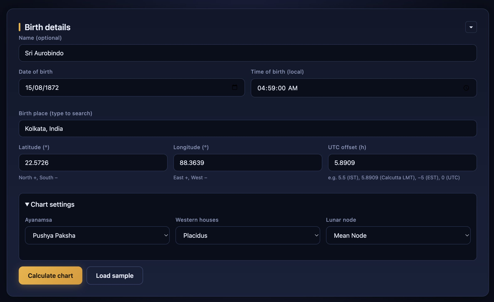
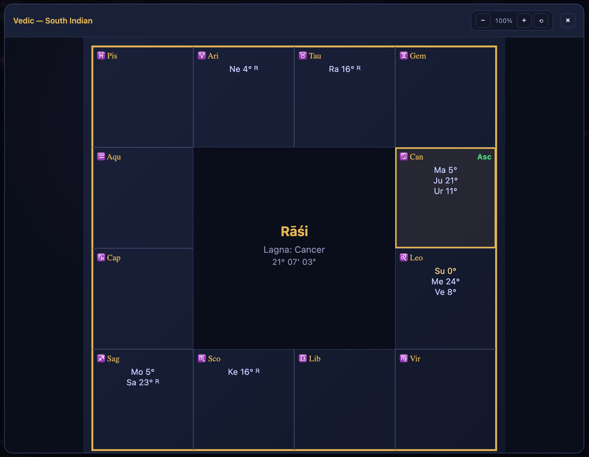
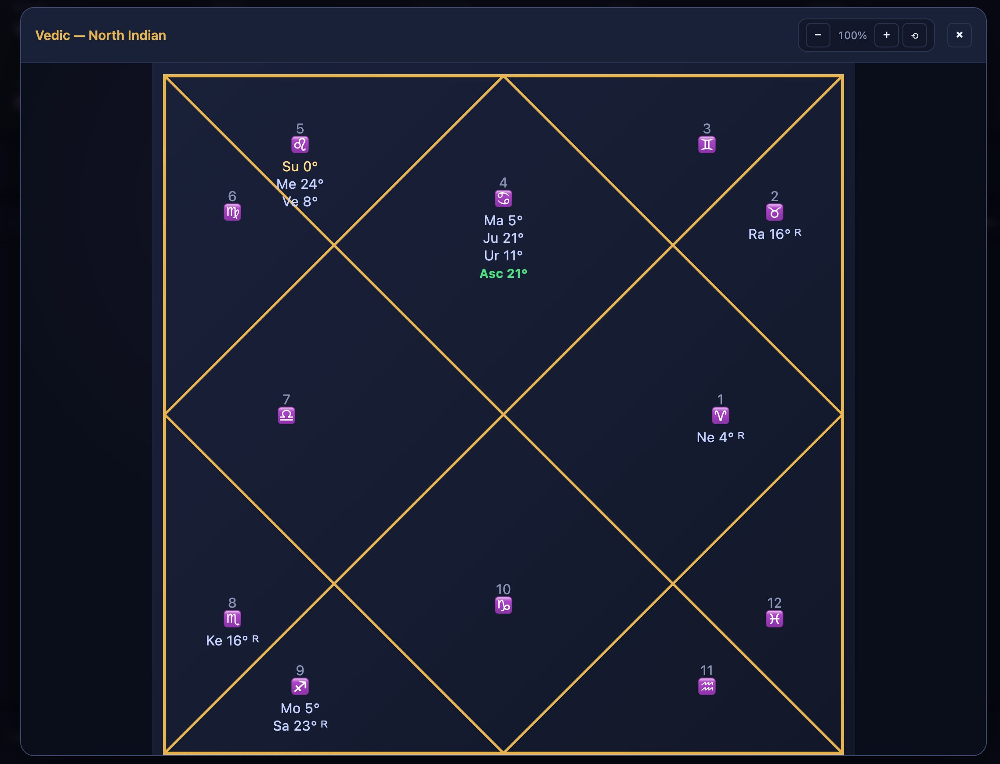
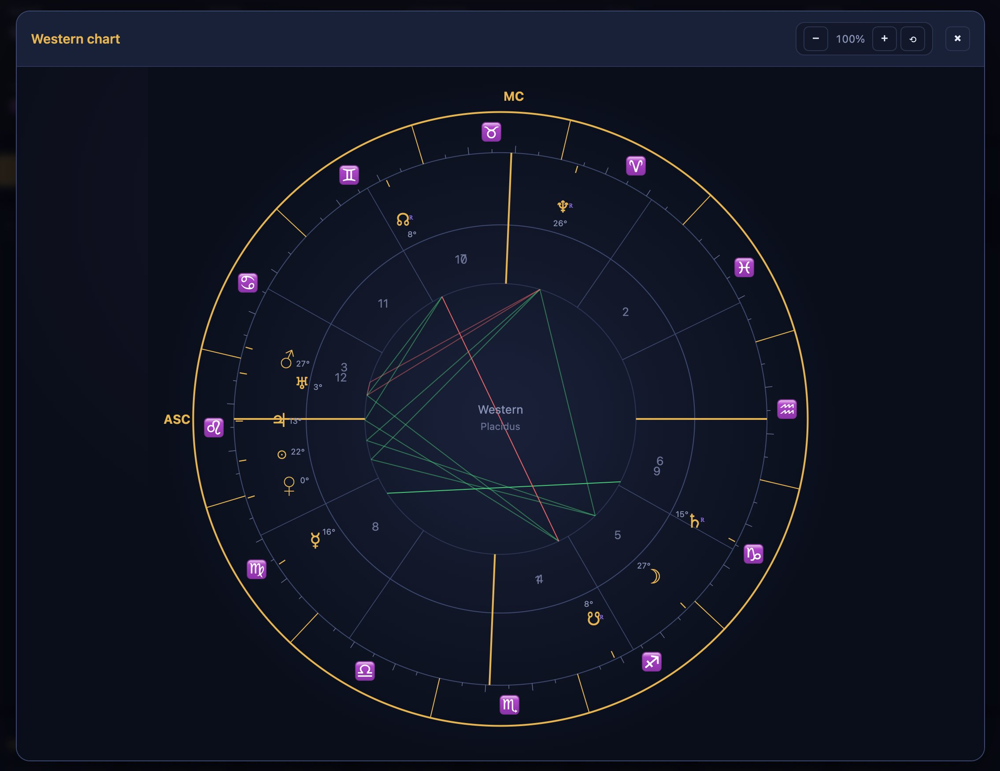
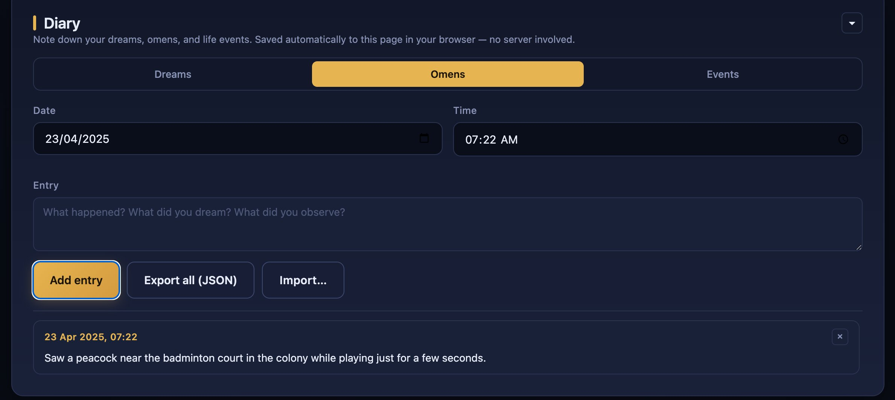

# Cosmic Diary

> Offline Western &amp; Vedic astrology calculator with personal diary, computed entirely in your browser. Zero network calls after page load.

**Live demo:** https://naveenkumarreddym.github.io/Cosmic-diary/

**Range:** 369 CE – 3369 CE &nbsp;&middot;&nbsp; **Accuracy:** ≤ 1′ for planets, arc-seconds for Sun/Moon across most of the range.

---

## Screenshots

### Birth details form
Enter date, time, place — or pick from 2,200+ bundled cities with autocomplete. Ayanamsa, house system, and lunar node type are all configurable.



### Vedic South Indian chart
Fixed-sign 4×4 grid with Lagna highlighted in gold and the ascendant tagged.



### Vedic North Indian chart
Classic diamond layout with houses numbered relative to the ascendant.



### Western circular chart
Placidus, Whole Sign, or Koch houses with planet glyphs and aspect lines.



### Diary
Note dreams, omens, and events across three tabs. Entries persist in browser `localStorage` — export/import JSON for backups.



---

## Features

### Astrology
- **Western chart** — circular layout with selectable house systems (Placidus, Whole Sign, Koch) and aspect lines
- **Vedic chart** — both North Indian (diamond) and South Indian (grid) layouts
- **Divisional charts (Vargas)** — D1 Rāśi, D2 Horā, D3 Drekkāṇa, D7 Saptāṁśa, D9 Navāṁśa, D10 Daśāṁśa, D12 Dvādaśāṁśa, D30 Triṁśāṁśa, D60 Ṣaṣṭiāṁśa
- **Ayanamsa options** — Lahiri (Chitrapaksha) and Pushya Paksha
- **Lunar node options** — Mean or True Rahu/Ketu
- **Vimshottari Daśā** — Mahā → Antar → Pratyantar, cycles beyond 120 years handled
- **Transits** — arbitrary-date transit positions and aspects to natal
- **Event scanner** — finds tight transit aspects across a date range
- **AI prompt generator** — packages your chart into a ready-to-paste prompt for any LLM

### Diary (persistent, browser-local)
- Three tabs: **Dreams · Omens · Events**
- Entries saved automatically to `localStorage` — no server involved
- **Export/Import JSON** for backups and transferring between devices
- Scrollable list sorted newest-first

### Integrity check
- SHA-256 of the embedded JavaScript is baked in at build time
- On load, the browser recomputes the hash and displays ✓ Verified or ⚠ Mismatch
- Command-line verification of the whole file is also supported
- User diary data (in `localStorage`) is NOT part of the hash, so diary usage does not affect the integrity check

### Offline-first
- Single self-contained HTML file (~290 KB). No external assets, no CDNs, no trackers
- Works from `file://` or any web server
- Everything computed locally in JS: VSOP87D truncated series for planets, Meeus-style ELP2000 for the Moon
- Bundled city database: 2,200+ cities worldwide with lat / lon / timezone

---

## Running it

### Option 1: Visit the live demo
https://naveenkumarreddym.github.io/Cosmic-diary/

### Option 2: Download and open locally
1. Download `Cosmic_Diary.html` from the latest release (or clone this repo)
2. Double-click the file to open it in your browser
3. That's it — no install, no build, no network

### Option 3: Build from source
```bash
git clone https://github.com/naveenkumarreddym/cosmic-diary.git
cd cosmic-diary
bash src/build.sh
```
Output: `Cosmic_Diary.html` in the repo root, with the bundle and full-file SHA-256 printed to the terminal.

Requirements for building: `bash` and `python3` (both usually present on macOS/Linux; on Windows use WSL or Git Bash).

---

## Verifying integrity

When you open `Cosmic_Diary.html`, the **About this tool** section displays:
- ✓ &nbsp;in green if the embedded code matches the hash baked in at build
- ⚠ &nbsp;in red if anything has been modified

You can also verify the entire file from the command line:

```bash
# Linux
sha256sum Cosmic_Diary.html

# macOS
shasum -a 256 Cosmic_Diary.html

# Windows PowerShell
Get-FileHash Cosmic_Diary.html -Algorithm SHA256
```

The official hash for each release is published in the [Releases](https://github.com/naveenkumarreddym/cosmic-diary/releases) page and is also visible in the in-page integrity panel.

---

## Project structure

```
cosmic-diary/
├── Cosmic_Diary.html          ← Built single-file deliverable (commit to repo)
├── LICENSE                    ← MIT
├── README.md                  ← this file
├── index.html                 ← redirects to Cosmic_Diary.html (for GitHub Pages)
├── screenshots/               ← images used in this README
└── src/
    ├── 02_time.js             ← Julian Day, Delta T, obliquity, nutation
    ├── 04a_vsop_inner.js      ← VSOP87D: Mercury, Venus, Earth
    ├── 04b_vsop_outer.js      ← VSOP87D: Mars, Jupiter, Saturn, Uranus, Neptune
    ├── 05_moon.js             ← Truncated ELP2000 lunar theory (Meeus)
    ├── 06_nodes.js            ← Mean and True Rahu/Ketu
    ├── 07_ayanamsa.js         ← Lahiri and Pushya Paksha
    ├── 08_houses.js           ← Placidus / Whole Sign / Koch house cusps
    ├── 09_chart.js            ← Main chart assembly, signs, nakshatras, aspects
    ├── 10_dasha.js            ← Vimshottari dasha with cycle repetition
    ├── 11_transits.js         ← Transit positions and event scanner
    ├── 12_render.js           ← SVG renderers: Western, North, South charts
    ├── 12b_vargas.js          ← Divisional chart computation + mini renderer
    ├── 12c_planet_icons.js    ← Inline SVG planet art for the Dasha card
    ├── 13_cities.js           ← City database + search
    ├── 14_ui.js               ← Form handling, tabs, rendering glue (must be last)
    ├── 15_prompt.js           ← AI prompt generator
    ├── 16_diary.js            ← Diary: localStorage CRUD + render
    ├── shell.html             ← HTML scaffold with CSS/JS substitution markers
    ├── styles.css             ← All styling, dark theme, responsive breakpoints
    └── build.sh               ← Concatenates modules, computes integrity hash,
                                  writes Cosmic_Diary.html
```

---

## How it works (brief)

**Planetary positions** — truncated VSOP87D series give heliocentric ecliptic coordinates. Subtracting Earth's position gives geocentric coordinates; a two-iteration light-time correction improves accuracy. Aberration and nutation in longitude are applied for apparent positions.

**Moon position** — Meeus-style truncated ELP2000 series (60 longitude + distance terms, 60 latitude terms). Accuracy ~10″ in longitude.

**Ayanamsa** — fixed anchor at J2000 plus IAU 1976 precession since J2000:
- Lahiri: 23°51′12.44″ at J2000
- Pushya Paksha: 23°15′00″ at J2000

**House systems** — standard Placidus semi-arc method, Koch variant, and Whole Sign.

**Vimshottari Daśā** — 120-year cycle keyed on Moon's nakshatra at birth; repeats indefinitely so dates far from birth still produce valid current periods.

**Integrity check** — SHA-256 computed over the concatenated JS bundle between `/*__INTEGRITY_START__*/` and `/*__INTEGRITY_END__*/` markers. The hash is substituted into the page via an `__EXPECTED_HASH__` placeholder at build. At runtime the browser hashes the same bytes and compares.

---

## Accuracy and caveats

- Planet longitudes: ≤ 1 arcminute from ~1000 CE onward; degrades to a few arcminutes at 369 CE and 3369 CE extremes
- Sun and Moon: arc-second accuracy across the full range
- **Timezone is your responsibility** — historical DST is not auto-resolved. For pre-1970 births in the US/Europe, double-check the correct UTC offset
- **Polar latitudes** (> ±66.5°) may produce undefined Placidus/Koch cusps on some dates — use Whole Sign at high latitudes
- For mission-critical readings, cross-check against a Swiss Ephemeris-based tool (Jagannatha Hora, Astrodienst)

---

## Not a therapist, not a fortune-teller

This is a calculator. It computes astronomical positions and the symbolic frameworks traditionally built on top of them. It does not predict the future, diagnose conditions, or make decisions for you. If you are dealing with a serious life situation, talk to a real person — a friend, a counselor, or a professional in the relevant field.

---

## Contributing

Issues and pull requests are welcome. If you find a chart calculation that disagrees materially with Swiss Ephemeris, please include:
- The exact input (date, time, timezone, location)
- The expected and actual positions
- Which tool you're comparing against

---

## License

MIT — see [LICENSE](LICENSE).

---

## Credits

Planetary theory: Bretagnon &amp; Francou, VSOP87 (1988). Lunar theory and chapter reference implementations: Jean Meeus, *Astronomical Algorithms* (2nd ed., 1998). Delta T formula: Espenak &amp; Meeus (2006).
